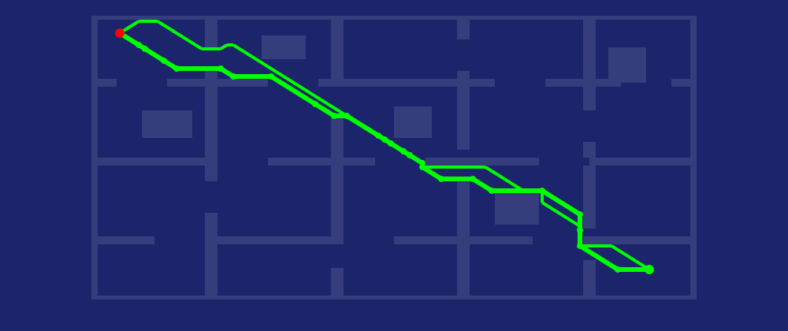
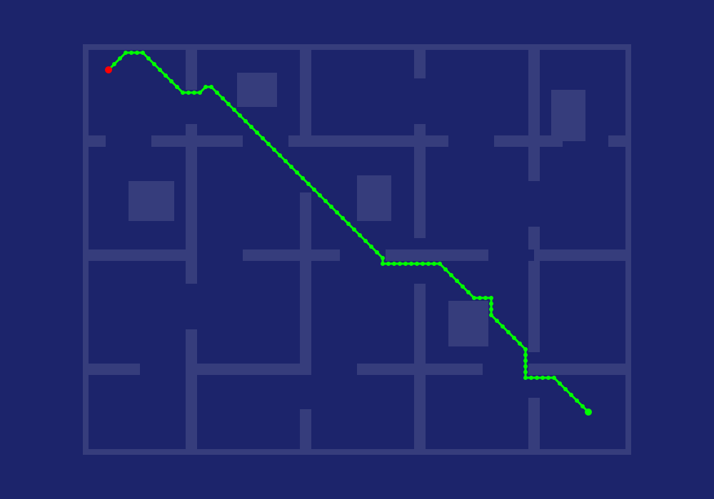
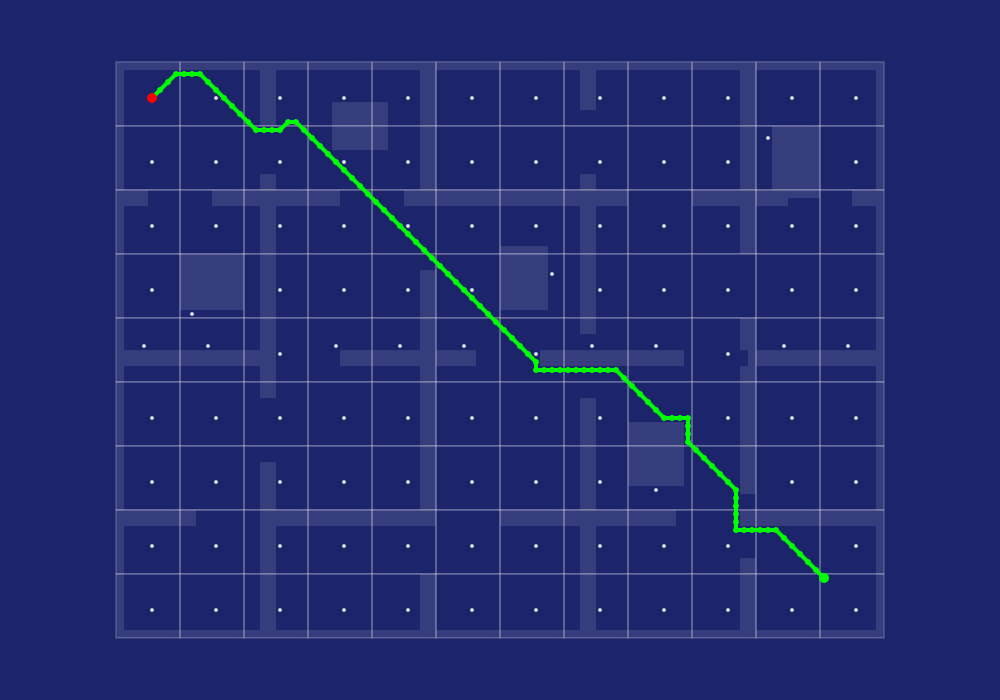
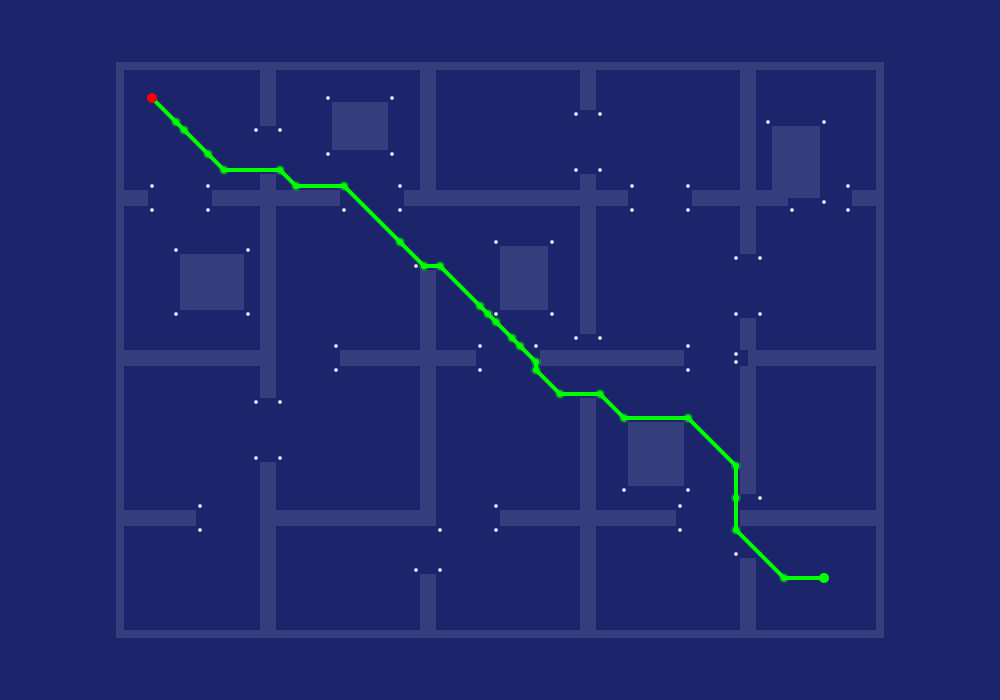

# pathy - Pathfinding spaces for Nim.

`nimby install pathy`


[API reference](https://treeform.github.io/pathy)

## About

Pathy provides pathfinding spaces for 2D grids. The spaces share a small API so
you can swap the pathfinder and compare behavior.

> **AI disclaimer: Much of this library was AI generated.**

The library currently includes:

- `PathSpace` for direct A* over the full grid.
- `TilePathSpace` for tile A* with exact start and goal connectors.
- `JumpPointSpace` for JPS+ over precomputed jump distances.

All spaces take a flat `seq[bool]` walk mask, a width, a height, and a movement
mode. Use `DiagonalPath` for 8-way movement and `CardinalPath` for Manhattan
movement.

```nim
import pathy

let
  width = 16
  height = 12

var walkMask = newSeq[bool](width * height)
for i in 0 ..< walkMask.len:
  walkMask[i] = true

let
  path = newPathSpace(walkMask, width, height, DiagonalPath)
  tiles = newTilePathSpace(path, tileSize = 4)
  jps = newJumpPointSpace(path)

echo path.findPath(2, 2, 13, 9)
echo tiles.findPath(2, 2, 13, 9)
echo jps.findPath(2, 2, 13, 9)
```

Call `update` when the grid changes.

```nim
path.update(walkMask)
tiles.update(path)
jps.update(path)
```

`JumpPointSpace` uses the extracted JPS+ algorithm when diagonal movement is
enabled. In `CardinalPath` mode it preserves the shared API with exact cardinal
A* behavior, because the JPS+ pruning tables are diagonal-grid logic.

## PathSpace

`PathSpace` is the simple baseline. It runs A* directly over every passable
point in the grid.



This is the space to start with when you want the shortest path and do not need
setup time.

## TilePathSpace

`TilePathSpace` builds a coarse graph from tiles. It uses direct A* to reach a
tile node, navigates the tile graph, and then uses direct A* to reach the exact
goal.



Tile paths are usually close to the direct path, but they can be slightly
different because the route is planned through tile representatives.

## JumpPointSpace

`JumpPointSpace` precomputes JPS+ jump distances and then searches through jump
points.



The white points are precomputed jump points. The green points are the jump
points used by this route.

## Benchmark

Run:

```sh
nim r tests/bench_pathy.nim
```

Sample output from this checkout:

```text
routes: 64 tileSize: 8
same route points are reused by all scan benchmarks
selected direct distance: 2834
regular A* solved=64/64 pathDistance=3814 baseline=3814 delta=0
tile A* solved=64/64 pathDistance=4276 baseline=3814 delta=462
JPS+ solved=64/64 pathDistance=3814 baseline=3814 delta=0
JPS+ missing: 0
   min time    avg time  std dv   runs name
   0.117 ms    0.120 ms  +-0.004     x5 precompute tile A*
  13.792 ms   13.913 ms  +-0.089     x5 precompute JPS+
  95.005 ms   96.034 ms  +-0.642    x20 scan regular A*
  83.019 ms   83.518 ms  +-0.365    x20 scan tile A*
   1.595 ms    1.681 ms  +-0.062    x20 scan JPS+
checksum: 55404
```

## Development

Run checks and tests:

```sh
nim check src/pathy.nim
nim r tests/tests.nim
```

Regenerate README images:

```sh
nim r tools/gen_readme.nim
```
